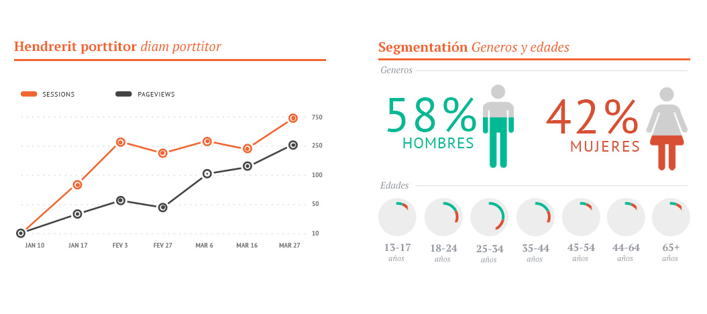
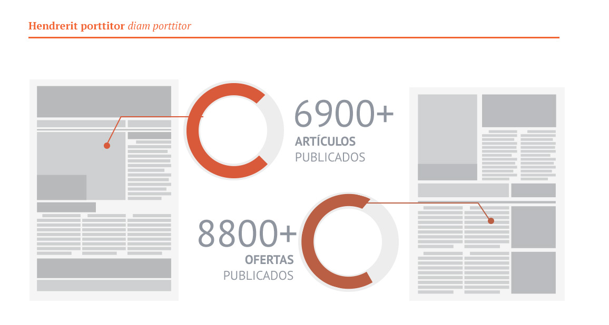
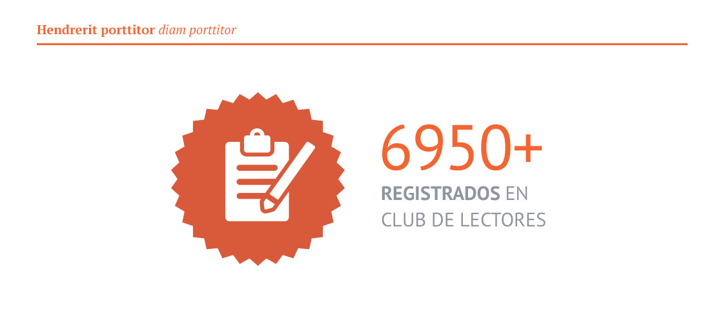
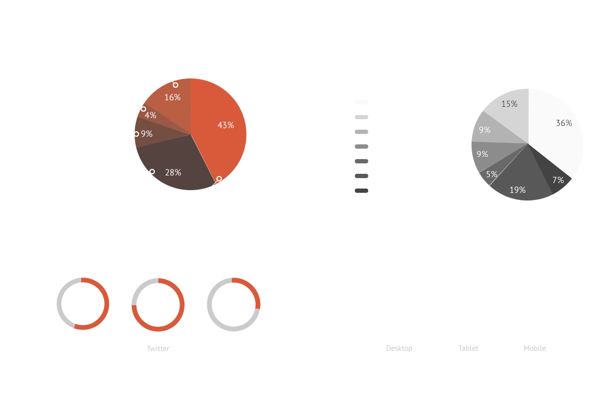
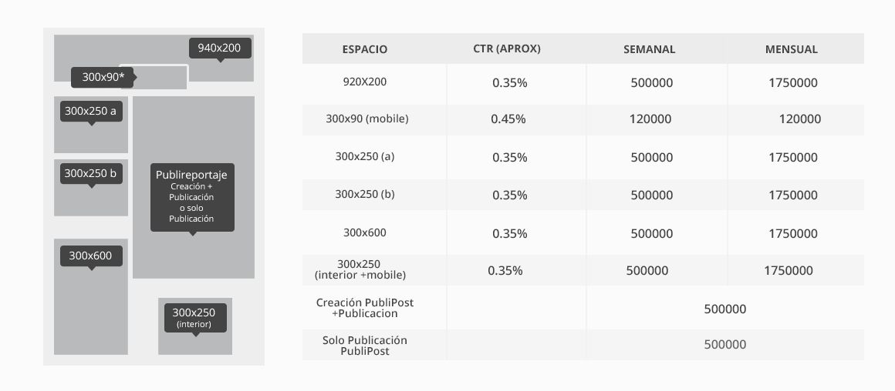
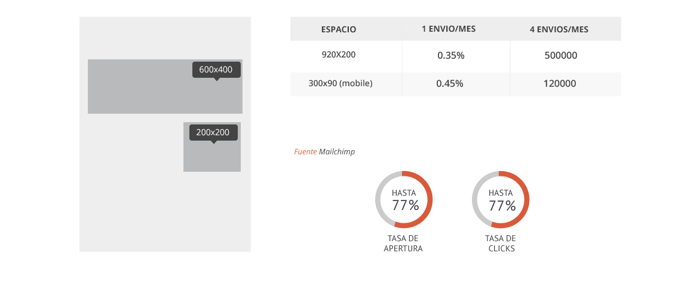
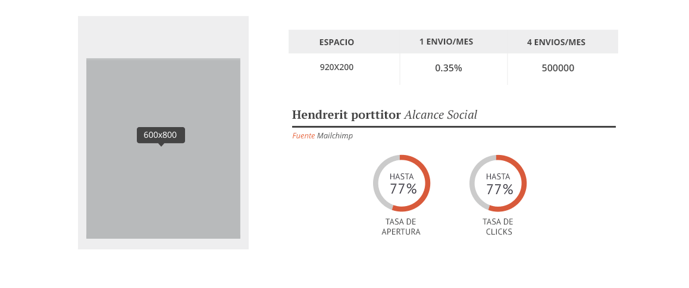

##Vestibulum et congue 
tempus nisl vulputate. Maecenas mattis dictum tortor ut iaculis. Duis pulvinar eros et purus fringilla facilisis. Pellentesque habitant morbi tristique 
{.imagen-full}
{.imagen-full}

{.imagen-full}

##Vestibulum et congue 
tempus nisl vulputate. Maecenas mattis dictum tortor ut iaculis. Duis pulvinar eros et purus fringilla facilisis. Pellentesque habitant morbi tristique	

##Vestibulum et congue 
tempus nisl vulputate. Maecenas mattis dictum tortor ut iaculis. Duis pulvinar eros et purus fringilla facilisis. Pellentesque habitant morbi tristique 

##TARIFAS NEWSLETTER
tempus nisl vulputate. Maecenas mattis dictum tortor ut iaculis. Duis pulvinar eros et purus fringilla facilisis. Pellentesque habitant morbi tristique 

##TARIFAS BASE DE DATOS
tempus nisl vulputate. Maecenas mattis dictum tortor ut iaculis. Duis pulvinar eros et purus fringilla facilisis. Pellentesque habitant morbi tristique 

##REDES SOCIALES
tempus nisl vulputate. Maecenas mattis dictum tortor ut iaculis. Duis pulvinar eros et purus fringilla facilisis. Pellentesque habitant morbi tristique 

